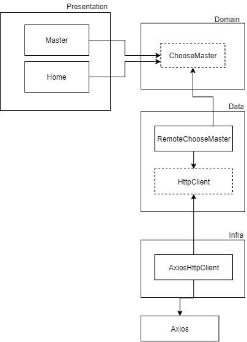

# SWAPI

Esse projeto foi criado com Create React App

```
node >= 12.19.0
npm >= 6.14.8
```

[demo](https://sezarthiago.github.io/swapi/) 

## Tecnologias

- React
- Typescript
- axios
- classnames
- react-router-dom
- jest
- @testing-library/react
- eslint
- prettier


## Metodologias

- Conventional commits
- Small commits
- Clean Architecture
- TDD

## Estrutura do projeto




## scripts

`npm run start` - Roda a aplicação no server local

`npm run build` - Build a aplicação para produção

`npm run test` - Executa os testes

`npm run lint` - Executa o eslint nos arquivos